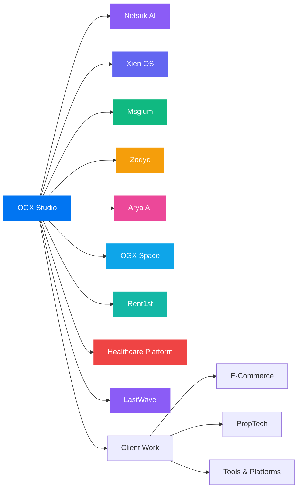

```markdown
<!--
  ┌─────────────────────────────────────────────────────────┐
  │  SHAKTI MANDAL  ·  Founder & Director, OGX Studio       │
  │  github.com/shaktixdev                                  │
  └─────────────────────────────────────────────────────────┘
-->

<div align="center">


<br><br>

<h1>👋 Hey, I'm Shakti</h1>


<br>

<a href="https://github.com/shaktixdev"></a>
<a href="https://www.linkedin.com/in/shaktimndal"></a>
<a href="https://ogxstudio.in"></a>
<a href="mailto:shakti@ogxstudio.in"></a>

</div>

<br>

---

## ▸ whoami

I design and ship **premium digital products** — AI systems, SaaS platforms, music technology, and enterprise software — from first sketch to production.

As Founder & Director at **[OGX Studio](https://ogxstudio.in)**, I work across product engineering, AI automation, modern web applications, and business software.

> Not templates. Not demos. Products engineered to solve real problems.

<details>
<summary><b>◎ open shakti.config.ts</b></summary>

<br>

```ts
export const shakti = {
  role: "Founder & Director",
  studio: "OGX Studio",
  based: "India · Worldwide",

  focus: [
    "AI Products & Multi-Agent Systems",
    "Premium SaaS & Enterprise Platforms",
    "Full-Stack Engineering + Product Design",
    "Music Technology & Audio Engineering",
  ],

  now: {
    building: "Netsuk AI — intelligent automation",
    shipping: "LastWave — music streaming & playback",
    developing: "Xien OS, Msgium, Zodyc & OGX Space",
  },

  creed: "Performance · Design · Reliability · Scale",
} as const;
```

</details>

<br>

<div align="center">

| 🏗️ Flagship | 🌍 Clients | 🧠 AI | 🎨 Design | ⚡ Delivery |
|:---:|:---:|:---:|:---:|:---:|
| **8+** products & initiatives | **15+** businesses | First-class | Pixel-led | End-to-end |

</div>

---

## ▸ the studio map

How everything connects — from OGX Studio to its product ecosystem, independent projects, and client solutions.



---

## ▸ flagship products

<table>
<tr>
<td width="50%" valign="top">

### 🏢 OGX Studio
[`ogxstudio.in`](https://ogxstudio.in)

The engineering studio building premium software, AI solutions, SaaS platforms, and digital products.

```
◉ Product engineering
◉ AI solutions & automation
◉ SaaS architecture
◉ Design systems
```

`ACTIVE` · [Visit →](https://ogxstudio.in)

</td>
<td width="50%" valign="top">

### 🤖 Netsuk AI

An AI-first initiative focused on intelligent agents, automation, and business workflows.

```
◉ AI agent orchestration
◉ Workflow automation
◉ LLM-powered intelligence
◉ AI infrastructure
```

`BUILDING` · `AI-FIRST`

</td>
</tr>
<tr>
<td width="50%" valign="top">

### 🎵 LastWave

A music streaming project focused on dependable playback, music discovery, audio quality, and a better listening experience.

```
◉ Music discovery
◉ Audio playback
◉ Lossless source handling
◉ Playback diagnostics
```

`IN DEVELOPMENT`

</td>
<td width="50%" valign="top">

### 🏠 Rent1st

A property management platform designed to simplify rental operations for owners, managers, and tenants.

```
◉ Property management
◉ Tenant discovery
◉ Verification workflows
◉ Rental operations
```

`IN DEVELOPMENT`

</td>
</tr>
<tr>
<td width="50%" valign="top">

### 🖥️ Xien OS

An AI-powered operating system experience designed to bring intelligent assistance into everyday workflows.

```
◉ AI-powered experiences
◉ Intelligent assistance
◉ Workflow integration
◉ Connected applications
```

`IN DEVELOPMENT`

</td>
<td width="50%" valign="top">

### 💬 Msgium

A business messaging and automation platform built around WhatsApp APIs and AI-assisted communication.

```
◉ WhatsApp API integration
◉ AI assistants
◉ Automated workflows
◉ Business messaging
```

`IN DEVELOPMENT`

</td>
</tr>
<tr>
<td width="50%" valign="top">

### 🌐 Zodyc

An open-source website and commerce builder focused on making digital product creation more accessible.

```
◉ Website creation
◉ Commerce experiences
◉ Flexible customization
◉ Developer-friendly tools
```

`IN DEVELOPMENT`

</td>
<td width="50%" valign="top">

### 🧠 Arya AI

An intelligent assistant layer envisioned to connect AI capabilities with everyday product and business workflows.

```
◉ AI assistance
◉ Context-aware workflows
◉ Product integrations
◉ Intelligent automation
```

`IN DEVELOPMENT`

</td>
</tr>
<tr>
<td width="50%" valign="top">

### 🏢 OGX Space

A business operations platform bringing essential business workflows into one connected workspace.

```
◉ CRM & lead management
◉ Appointments
◉ HRMS & operations
◉ Workflow automation
```

`IN DEVELOPMENT`

</td>
<td width="50%" valign="top">

### 🏥 Healthcare Platform

A healthcare software initiative focused on patient experiences, administration, and structured clinical workflows.

```
◉ Patient portals
◉ Role-based access
◉ Appointment workflows
◉ Healthcare analytics
```

`IN DEVELOPMENT`

</td>
</tr>
</table>

---

## ▸ selected work

Products and brands across commerce, property, lifestyle, and digital platforms — built through OGX Studio.

<table>
<tr>
<td align="center" width="33%" valign="top">

**🛍️ Commerce**

---

Healing Thyme  
Mamatui  
Mango Basket  
ThodaSaCrazy  
Rasoiya

</td>
<td align="center" width="33%" valign="top">

**🏡 PropTech & Lifestyle**

---

Global Acres  
Kiaan Properties  
Livome  
Maha Magic Vastu  
Rent1st

</td>
<td align="center" width="33%" valign="top">

**🛠️ Platforms**

---

PitchDeckHub  
Dobbico  
DG Orbit  
Desh Ghumo  
LastWave

</td>
</tr>
</table>

<details>
<summary><b>◎ what “shipped” means here</b></summary>

<br>

The work spans live client products, ongoing development, and product initiatives at different stages. The goal is to take ideas beyond slideware through practical design, engineering, integrations, and production-focused delivery.

</details>

---

## ▸ how I build

<table>
<tr>
<td width="33%" valign="top">

**🧠 Intelligence**

AI agents · LLM apps  
Automation · MCP  
RAG · Multi-agent systems

</td>
<td width="33%" valign="top">

**💼 Systems**

SaaS · CRM · ERP  
Dashboards · APIs  
Payments · Workflows

</td>
<td width="33%" valign="top">

**🌐 Surfaces**

Next.js · PWAs  
Shopify · Headless  
Commerce · Speed

</td>
</tr>
<tr>
<td width="33%" valign="top">

**🎨 Craft**

UI/UX · Design systems  
Brand · Figma  
Motion · Interaction

</td>
<td width="33%" valign="top">

**☁️ Ops**

Vercel · Docker  
Cloudflare · CI/CD  
Reliable infrastructure

</td>
<td width="33%" valign="top">

**🎵 Emerging**

Music technology  
Audio playback · Media  
AI infrastructure · Edge

</td>
</tr>
</table>

---

## ▸ stack

<div align="center">


<br><br>


</div>

---

## ▸ signal

<div align="center">


<br><br>


<br><br>


</div>

---

## ▸ operating principles

<div align="center">

> **Simple for users. Powerful for businesses. Exceptional for developers.**

</div>

<br>

<table>
<tr>
<td align="center" width="20%">

**⚡ Speed**  
<sub>Latency is UX</sub>

</td>
<td align="center" width="20%">

**🎨 Taste**  
<sub>Details compound</sub>

</td>
<td align="center" width="20%">

**🔒 Trust**  
<sub>Quiet reliability</sub>

</td>
<td align="center" width="20%">

**📈 Scale**  
<sub>Grow without rewrite</sub>

</td>
<td align="center" width="20%">

**✨ Feel**  
<sub>Delight on purpose</sub>

</td>
</tr>
</table>

---

<div align="center">

### Let's make something worth shipping

**AI Products** · **Enterprise Software** · **SaaS** · **Music Technology** · **Premium Digital Experiences**

<br>

<a href="https://ogxstudio.in"></a>
<a href="mailto:shakti@ogxstudio.in"></a>

<br><br>

<sub><b>Shakti Mandal</b> · Founder & Director, <a href="https://ogxstudio.in">OGX Studio</a></sub>  
<sub><i>Crafted at the intersection of design, engineering, and business.</i></sub>  
<sub>© 2026 OGX Studio · Built with intention</sub>
</div>
```
